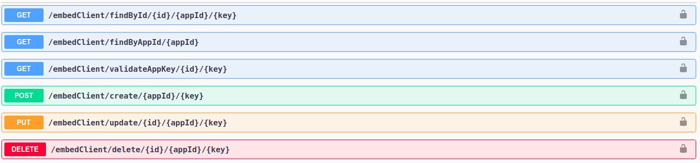
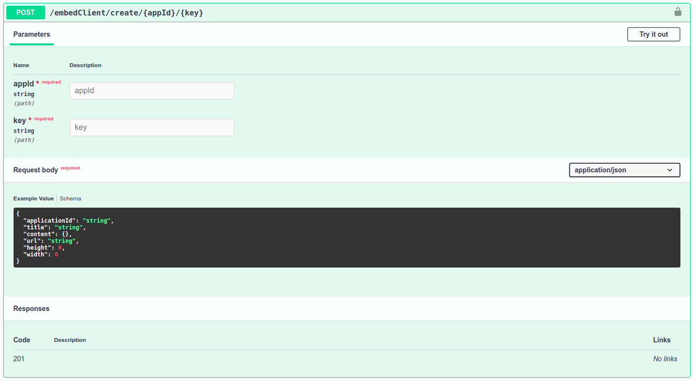
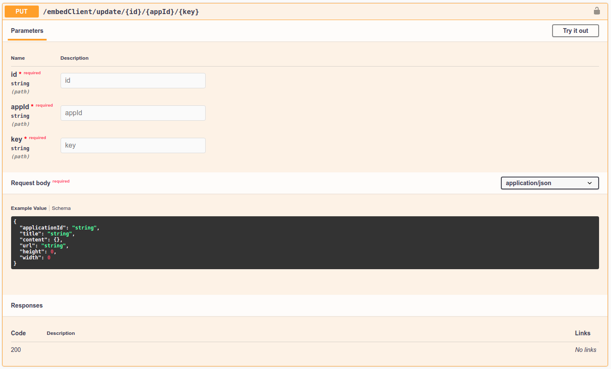
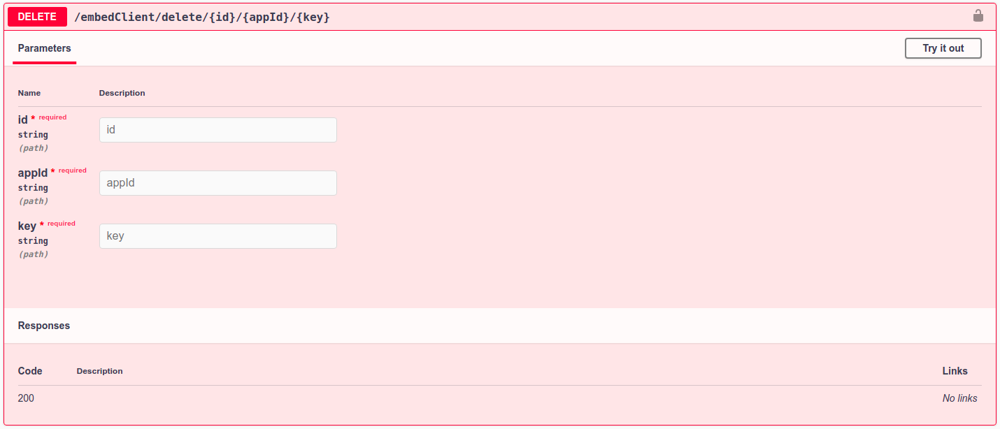

# Presence Embed
This project is a sample to show how to intergret and embed external webpages and applications with presence application. 
The sample contains two applications 

* Server app showing how to access presence's embed api from backend applications
* Front end (simple react application)

Integrating with presence steps
* The first step is to register the application you want to integrate/embed using presence (you must have an account in presence).
* After registering the aplication, presence will provide you with an application id and application secret key.
## Getting Started with the API

Presence provides the following REST endpoints and methods:



You can use the below URL to open the API swagger documentation.
* http://18.216.200.57:3000/embed/


## Get Your Application Id and Application Key
Before you can use the API you'll need to get your application id and application key, which you use to authenticate with presence API. You will have your `application Id` and `key`, once you register your application in presence platform.

## The following steps walk you through the basics to get started using the API

**Create Embed**

----
  Use this API to create Embed, accepted parameters are explained below.

* **URL**

  /embedClient/create/{appId}/{key}

* **Method:**
  
  The request type is `POST` 
  
*  **URL Params**

   **Required:**
 
   * `appId=[string]`   
   * `key=[string]`

* **Request body**
    <br/>
The request body accepts the below json format. `applicationId` and `url` are the only required response body fields. You can specify your own height and width in `px`. If the width or height value is not specified the default values (`height=700px` and `width='100%'`) will be used. 
```
  {
	  "applicationId": "string",
	  "title": "string", 
	  "url": "string",
	  "height": number,
	  "width": number
  }
```
**Update Embed**

----
  Use this API to update Embed, accepted parameters are explained below.

* **URL**

  /embedClient/update/{id}/{appId}/{key}

* **Method:**
  
  The request type is `PUT` 
  
*  **URL Params**

   **Required:**
   * `id=[string]` 
   * `appId=[string]`   
   * `key=[string]`

* **Request body**
    <br/>
The request body accepts the below json format.You can specify your own height and width in `px`. If the width or height value is not specified the default values (`height=700px` and `width='100%'`) will be used. 
```
  {
	  "applicationId": "string",
	  "title": "string", 
	  "url": "string",
	  "height": number,
	  "width": number
  }
```

**Delete Embed**

----
  Use this API to delete existing Embed, accepted parameters are explained below.

* **URL**

  /embedClient/delete/{id}/{appId}/{key}

* **Method:**
  
  The request type is `DELETE` 
  
*  **URL Params**

   **Required:**
   * `id=[string]` 
   * `appId=[string]`   
   * `key=[string]`